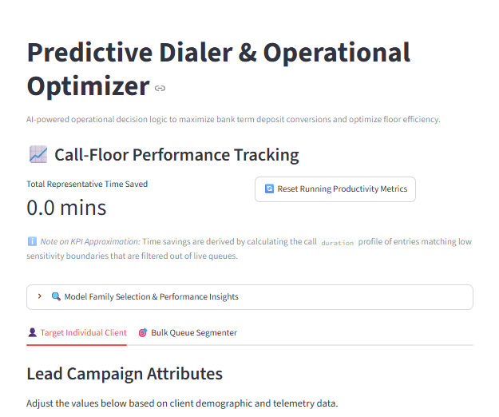

# 📞 Bank Term Deposit Predictive Dialer & Operational Optimizer

This repository houses an end-to-end predictive pipeline designed to identify, rank, and target bank clients with the highest propensity to subscribe to term deposit opportunities. By transitioning from traditional cold calling to an intelligent, automated thresholding engine, this pipeline maximizes sales conversions while slashing unnecessary agent talk time.


> 🌐 **Live App:** Run the deployment dashboard live at [Term Deposit Conversion Intelligence App](https://streamlit.app)
>
> 📄 **Looking for a deep dive?** Read the detailed [Project Overview](reports/summary/project_overview.md) for complete structural EDA findings, technical ROC AUC tuning justifications, and business-focused strategic recommendations.

---

## 🖥️ Application Preview


---

## ✨ Key Features

* **High-Separation Modeling:** `RandomForestClassifier` optimized to conquer extreme class imbalance (7.24% positive base rate), achieving a **0.932 ROC AUC**, **0.85 Max Conversion Accuracy**, and **0.91 Max Efficiency Accuracy** on holdout validation data.
* **Decoupled Architecture:** Cleanly isolated modular codebase splitting data ingestion (`load_data.py`), model screening (`tune_hyperparameters.py`), and post-processing threshold adjustments (`tune_thresholds.py`).
* **Calibrated Decision Boundaries:** Powered by scikit-learn's `TunedThresholdClassifierCV` to programmatically optimize target execution thresholds over cross-validation splits.
* **Dual-Mode Business Dashboard:** An interactive Streamlit application enabling floor managers to instantly toggle the active model strategy based on call center capacity constraints:
  1. *Call Conversion Efficiency Mode:* Minimizes total dial loops to protect agent bandwidth and lower labor costs.
  2. *Maximum Conversions Mode:* Expands dialing scope aggressively to capture total liquid market volume.

---

## 📁 Project Structure

```text
├── data/       # Raw and processed datasets (excluded for privacy)
├── notebooks/  # Exploratory data analysis & modeling experimentation
├── reports/    # Detailed findings, executive summaries, & figures
│   ├── figures/# Saved plots (ROC curve, PR curve, Confusion Matrices)
│   └── summary/
│       └── project_overview.md
├── src/        # Core source code and utilities
│   ├── models/    # Saved .joblib model artifacts & metadata
│   ├── streamlit/ # Dashboard layout & application UI logic
│   └── utils/     # load_data, tune_hyperparameters, and tune_thresholds modules
└── app.py      # Streamlit application entry point
```

---

## 🚀 Quickstart & Usage

### 1. Launching the Streamlit Dashboard Locally

Run the interactive dashboard directly from the project root directory:

```bash
streamlit run ./app.py
```

---

### 2. Multi-Module Execution Pipeline

The modernized codebase isolates responsibilities across three distinct files to guarantee data separation and allow custom boundary tuning post-training.

#### Core Code Modules:

| Module | Purpose | Key Components |
| --- | --- | --- |
| `src/utils/load_data.py` | Handles data ingestion, pipeline mapping, and stratified partitioning. | `get_split_from_file()` |
| `src/utils/tune_hyperparameters.py` | Manages hyperparameter optimization loops and diagnostic parameter grid tracking. Enforces an explicit test-set evaluation firewall. | `ModelTuner` class |
| `src/utils/tune_thresholds.py` | Ingests models, encodes target string labels, and extracts optimal probability limits via cross-validation curves. Export plots. | `ClassificationThresholdTuner` class |

---

## 💡 Example Workflow

Below is a complete workflow example demonstrating data ingestion, randomized search optimization, and post-processing threshold calibration inside your development environment:

```python
import sys
from pathlib import Path
from scipy.stats import randint
from sklearn.ensemble import RandomForestClassifier

# Resolve project root path
project_root = Path.cwd().parent.parent
sys.path.insert(0, str(project_root))

from src.utils.load_data import get_split_from_file
from src.utils.tune_hyperparameters import ModelTuner
from src.utils.tune_thresholds import ClassificationThresholdTuner

# 1. Ingest Data with Stratified Splitting to protect 7.24% positive class profile
data_path = "../../data/raw/bank_marketing.csv"
predictor_col = "y"
random_state = 0

split_data = get_split_from_file(
    filename=data_path, 
    predictor=predictor_col, 
    test_size=0.2, 
    random_state=random_state
)

# 2. Hyperparameter Optimization via ModelTuner
feature_columns = ["age", "balance", "duration", "campaign", "day", "month", "housing", "loan"]
base_estimator = RandomForestClassifier(random_state=random_state)

hyper_grid = {
    "n_estimators": randint(50, 150),
    "max_depth": randint(5, 20),
    "min_samples_split":,
}

tuner = ModelTuner(
    model=base_estimator,
    split=split_data,
    featureNames=feature_columns,
    cv=5,
    random_state=random_state
)

# Run cross-validated optimization search
search_results = tuner.tune_model(hyperParameterGrid=hyper_grid, n_iter=50, scoring="roc_auc")
best_model = search_results.best_estimator_

# 3. Post-Processing Threshold Calibration via ClassificationThresholdTuner
threshold_tuner = ClassificationThresholdTuner(
    model_estimator=best_model,
    split=split_data,
    scoring=["roc_auc", "f1"],
    cv=5
)

# Print structural metrics and performance maps to disk
print(threshold_tuner)
threshold_tuner.print_classification_reports()
threshold_tuner.get_precision_recall_curve(metric_key="f1")
threshold_tuner.get_confusion_matrix(score=["roc_auc", "f1"])
```

> ⚠️ **Test Set Lockout Safeguard:** The `ModelTuner` class implements a strict structural lockdown context flag. Once a test-scoring metric function evaluates holdout records, the system explicitly raises an exception blocking any downstream feature configuration adjustments or tuning modifications. This mathematically guarantees zero production data leakage.
