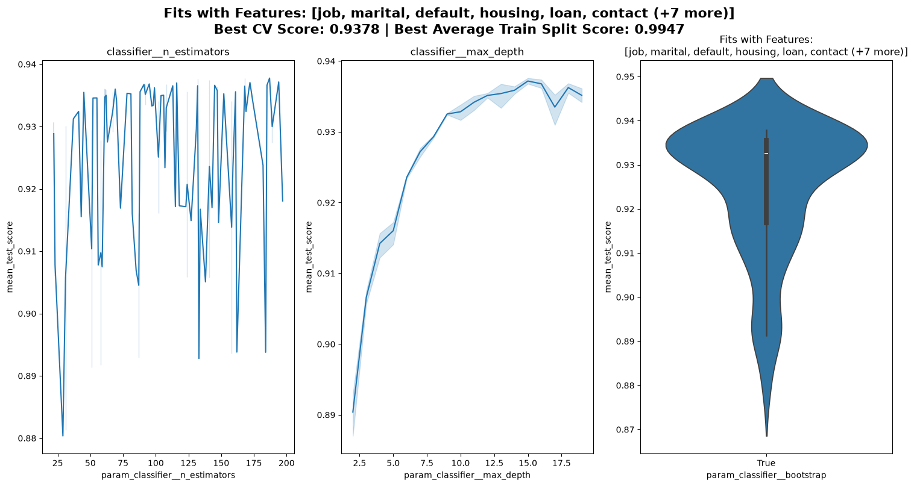

# Project Overview

* **Project Objective**: To provide a new method to find and target clients that are likely to participate in this company's term deposit opportunities.
* **Core Achievement**: Developed a `RandomForestClassifier` achieving a **ROC AUC of 0.932** and an **Accuracy of 0.924** on the unseen test set, backed by a Streamlit interactive tool that allows for a choice between a model optimized for call conversion efficiency (saving labor costs) and for maximum number of conversions achieved (no shortage of labor).
* **Business Value**: Provides a seamless and instant transition between models that maximize efficiency or pure conversion, making the sales process yield greater conversion rates while lowering net calls made.

---

# Exploratory Data Analysis (EDA)

## Explaining the Data

* **Dataset Size**: 40,000 total conversion records.
* **Feature Schema**:
  * **$Y$**: `invest` — Target attribute — Has the client subscribed to a term deposit? (Binary: `0` = No, `1` = Yes)
  * **$X_1$**: `age` — Age of customer (Numeric)
  * **$X_2$**: `job` — Type of job (Categorical)
  * **$X_3$**: `marital` — Marital status (Categorical)
  * **$X_4$**: `education` — Education level (Categorical)
  * **$X_5$**: `default` — Has credit in default? (Binary)
  * **$X_6$**: `balance` — Average yearly balance in euros (Numeric)
  * **$X_7$**: `housing` — Has a housing loan? (Binary)
  * **$X_8$**: `loan` — Has a personal loan? (Binary)
  * **$X_9$**: `contact` — Contact communication type (Categorical)
  * **$X_{10}$**: `day` — Last contact day of the month (Numeric)
  * **$X_{11}$**: `month` — Last contact month of the year (Categorical)
  * **$X_{12}$**: `duration` — Last contact duration in seconds (Numeric)
  * **$X_{13}$**: `campaign` — Number of contacts performed during this campaign for this client (Numeric)

### Feature Insights

* **Severe Class Imbalance**: 
  * The dataset is heavily skewed, with only a **7.24% positive case rate** (subscribed).
  * *Mitigation*: Evaluated architectures using ROC AUC alongside standard accuracy to prevent the models from simply over-indexing on the majority non-converting class.
* **Missing Data Volatility**: 
  * **34.26% of data samples** contain at least one missing value, isolated predominantly within the `contact` communication method column.
  * *Mitigation*: Because the core dataset is highly expansive ($N = 40,000$), dropping incomplete records leaves an ample volume of clean records to establish high-confidence baselines without sacrificing generalizability.
* **Call Duration Dynamics**:
  * Last contact duration ($X_{12}$) acts as a strong predictive signal. This likely represents an interaction proxy: customers who are genuinely entertaining the term deposit offer stay on the line longer to evaluate the opportunity before confirming their investment.


---

# Modeling Methodology

The execution pipeline includes a clean, decoupled architecture split across three core specialized modules:

```src/utils/
├── load_data.py              # Data ingestion and stratified partitioning
├── tune_hyperparameters.py   # Hyperparameter tuning and model optimization
└── tune_thresholds.py        # Custom thresholding for operational modes
```

## 1. Data Ingestion & Partitioning (`load_data.py`)
* **Core Routine**: `get_split_from_file(filename, predictor, **kwargs)`
* **Functional Mechanics**:
  * Standardizes seed environments by binding a global `np.random.seed()` context directly onto custom `random_state` arguments (defaulting to `0`).
  * Ingests target conversion logs and programmatic matrices, programmatically isolating the designated `predictor` array ($Y$) from candidate attributes ($X$).
  * Enforces a stratified data split (defaulting to an [80% / 20%] training and holdout validation partition) to explicitly protect and preserve the delicate **7.24% class distribution profile** downstream.

## 2. Model & Hyperparameter Optimization (`tune_hyperparameters.py`)
* **Core Object**: `ModelTuner`
* **Instantiation**: Initialized with a target model instance, the split data tuple from `load_data.py`, a baseline list of feature names, and tuning configurations (e.g., `cv` strategy folds, random seed overrides, visual truncation thresholds).
* **Optimization Method**:
  * `tune_model(hyperParameterGrid, **kwargs)`: Configures and executes an sklearn `RandomizedSearchCV` engine leveraging the internal `random_state` and feature matrix partitions. Prints the best cv score and estimator parameters to terminal before storing and caching the final validation profile.
* **Visual Exploration & Verification**:
  * `display_parameter_fits(search, hyperParameterGrid, groupby=None, **kwargs)`: Generates an internal diagnostic dashboard utilizing custom-wrapped `matplotlib`, `sns.violinplot`, and `sns.lineplot` blocks.
  * Supports complex parameter interaction analyses via the `groupby` argument, automatically parsing linear distributions, discrete arrays, or continuous scipy distribution models (with optional `log_scale` mathematical space adjustments).
* **Strict Evaluation Lockout Safeguard**:
  * The internal flag `self._predicting` acts as a firewall protecting pipeline integrity.
  * Once the holdout test matrix split is exposed or queried, methods like `set_features()`, `change_model()`, and `tune_model()` will explicitly throw an exception: *"Tuner can no longer tune once the test set has been looked at. Please make a new tuner with a new random state."* This guarantees absolute insulation against data leakage.

## 3. Post-Processing Operational Thresholding (`tune_thresholds.py`)
* **Core Object**: `ClassificationThresholdTuner`
* **Instantiation & Mapping**:
  * Consumes an un-fitted model estimator, split tuple data from `load_data.py`, a custom optimization metric configuration (defaults to `["roc_auc", "f1"]`), and cross-validation metrics.
  * Utilizes `LabelEncoder` to automatically map string labels (e.g., `'no'`, `'yes'`) into discrete, numerical target indices for pipeline mathematical stability.
  * Wraps the model using `TunedThresholdClassifierCV`, fitting it across structural cross-validation folds to programmatically calculate and isolate ideal probability decision limits (`best_threshold_`) for each score type.
* **Performance Reporting & Evaluation Tools**:
  * `print_classification_reports()`: Automatically evaluates performance boundaries against test slices. Automatically extracts and translates raw prediction thresholds back into original labeled strings via `.inverse_transform()` to compile descriptive class metrics.
  * `get_roc_curve()`: Compiles false-positive and true-positive ratios using holdout probabilities, charting a visual coordinate line highlighting the exact location of the optimized threshold against standard geometric guess lines.
  * `get_precision_recall_curve(metric_key)`: Generates precision-recall layouts using custom `PrecisionRecallDisplay` methods, centering an explicit plot marker mapping the exact position of the model's chosen decision boundary.
  * `get_confusion_matrix(score)`: Compiles test classification boundaries via `ConfusionMatrixDisplay` maps to chart error groupings under specialized metric limits.

---

# Model Performance and Interpretability

## Tuned Model Results


| Model | Final Test Set ROC AUC | Final Test Set Accuracy | CV ROC AUC Score | CV Accuracy Score | Features Excluded | Preprocessing Methods |
|---|---|---|---|---|---|---|
| **Random Forest** | **0.9324** | **0.9241** | $0.9378$ | Not Completed | None | Dropped missing rows |




## Technical Metric Justification: ROC AUC vs. Raw Accuracy

During the hyperparameter tuning phase, **ROC AUC was selected as the foundational optimization metric over raw Accuracy** due to the extreme class imbalance present in the conversion data (7.24% positive subscription rate). 

* **The Accuracy Paradox**: In a dataset where 92.76% of customers do not subscribe, a naive or completely un-optimized model could simply predict "No" for every single phone call and achieve a deceptively high raw accuracy score of **92.76%**. 
* **The Operational Cost of Accuracy Optimization**: Tuning a model to maximize raw accuracy in highly skewed environments forces the algorithm to over-index on the majority class. Operationally, this would result in a model that refuses to flag *any* clients as potential leads, completely paralyzing outbound sales.
* **Why ROC AUC Prevents Distortion**: ROC AUC evaluates the model's capacity to separate classes by measuring the probability that a randomly chosen successful conversion will be ranked higher than a randomly chosen non-conversion. By optimizing for an unseen test set ROC AUC of **0.932**, the pipeline guarantees strong predictive separation across all probability thresholds. This directly enables the flexible "Efficiency vs. Conversion" toggle feature in the front-end application.


## Key Analytical Findings
* **Dual-Threshold Optimization**: The `RandomForestClassifier` provided the highest validation stability. It serves as the framework for generating distinct probability thresholds to toggle operations between call efficiency and total conversions.
* **Imbalance Distortion**: While Accuracy scores look superficially high ($\sim 92.4\%$), they sit close to the baseline zero-conversion rate ($\sim 92.76\%$). This underscores why ROC AUC ($0.9324$) serves as our true north star for evaluating actual model separation performance.
* **Feature Permutation Rankings**:
  * Model performance degradation tests confirm that `duration` is the singular dominant predictor, yielding a score penalty of **0.297**. 
  * Macro operational windows follow, with `month` scoring **0.091** and calendar positioning (`day`) scoring **0.024**.
  * Outright risk factors such as `housing` (**0.01**) and deep financial baselines like `balance` (**0.003**) and customer `age` (**0.003**) dictate final model micro-adjustments.
* **SHAP Interpretability & Granular Dispersions**:
  * Because categorical columns are expanded via one-hot encoding, global SHAP feature attributions distribute importance across specific sub-categories rather than holistic variables.
  * The top-tier SHAP impact factors rank as follows: `duration` $\rightarrow$ `month (april)` $\rightarrow$ `day` $\rightarrow$ `month (july)` $\rightarrow$ `month (mar)` $\rightarrow$ `age` $\rightarrow$ `housing (no)` $\rightarrow$ `balance` $\rightarrow$ `housing (yes)` $\rightarrow$ `marital (married)` $\rightarrow$ `month (feb)` $\rightarrow$ `month (may)`.
  * These granularities reveal specific operational anomalies. For example, specific month segments (such as April, July, and March) exert significantly heavier directional weight on conversions than May or February, pointing to seasonal variance in consumer deposit trends.

---

# Streamlit App

* **Automated Model Discovery**: Automatically detects `.joblib` files created by model serialization routines in `src/models/saved_models/`.
* **Metadata Extraction**: Displays stored model metadata directly beneath the user's choice, including the active feature set used during inference.
* **Operational Mode Toggle**: 
  * Features a prominent interactive toggle for business stakeholders to select the active operational goal:
    1. *Call Conversion Efficiency*: Adjusts prediction probability thresholds via the mappings defined in `tune_thresholds.py` to minimize outbound dial volumes, saving labor hours by only targeting high-probability clients.
    2. *Maximum Conversions*: Lowers decision thresholds to maximize raw conversion count when call center staff capacity is unconstrained.
* *[Note: UI implementation ongoing]*

---

# Strategic Recommendations

* **Capitalize on Customer Conversational Engagement**:
  * *Insight*: Higher values in `duration` ($X_{12}$) suggest that clients who lean into the conversation to actively evaluate the term deposit architecture yield the highest conversion probability. Longer talk time is a positive buying signal.
  * *Action*: Train sales agents to prioritize qualitative rapport-building, educational product drilling, and objection-handling over arbitrary call-length constraints. Do not rush clients off the phone to hit volume metrics; handle long-duration calls as high-intent pipeline.
* **Prioritize Seasonal and Calendar-Based Dialing Schedules Over Demographics**:
  * *Insight*: Individual client demographics such as account balance ($X_6$) and age ($X_1$) exert surprisingly minimal impact on conversion probabilities. Instead, seasonal timing—specifically the month ($X_{11}$) and the day of the month ($X_{10}$) when contact occurs—serves as a significantly stronger driver of campaign engagement.
  * *Action*: Refocus outbound dialing priority engines away from traditional wealth or demographic segmentation. Shift campaign infrastructure to target clients aggressively during high-performing historical windows (such as April, July, and March batches) and optimized intra-month calendar blocks, as external market seasonality dictates a client's willingness to invest far more than their baseline account balance.
* **Dynamically Match Staffing Capacity to Lead Lists**:
  * *Insight*: Labor costs and seasonal agent availability dictate floor performance. The application can instantly toggle decision thresholds to protect operations.
  * *Action*: During periods of low staffing or high lead acquisition costs, run the interface in *Call Conversion Efficiency* mode to shield agents from cold leads. When sales capacity is unconstrained or conversion quotas must be forced, flip to *Maximum Conversions* mode to aggressively capture raw market volume.